```r
library(knitr)
```

```
## Warning: package 'knitr' was built under R version 3.3.3
```

```r
opts_chunk$set(warning = FALSE)
```

# Penguin walk I
## Data loading


```r
dir.create('data', recursive = TRUE)

dataUrls <- c('https://s3.amazonaws.com/drivendata/data/47/public/training_set_observations.csv',
              'https://s3.amazonaws.com/drivendata/data/47/public/training_set_nest_counts.csv',
              'https://s3.amazonaws.com/drivendata/data/47/public/submission_format.csv',
              'https://s3.amazonaws.com/drivendata/data/47/public/training_set_e_n.csv')

sapply(dataUrls, function (url) {
    destfile <- paste('data', basename(url), sep='/')
    download.file(url, destfile = destfile)
    c(destfile = file.info(destfile)['size'])
})
```

```
## $`https://s3.amazonaws.com/drivendata/data/47/public/training_set_observations.csv.destfile.size`
## [1] 331605
## 
## $`https://s3.amazonaws.com/drivendata/data/47/public/training_set_nest_counts.csv.destfile.size`
## [1] 61364
## 
## $`https://s3.amazonaws.com/drivendata/data/47/public/submission_format.csv.destfile.size`
## [1] 24866
## 
## $`https://s3.amazonaws.com/drivendata/data/47/public/training_set_e_n.csv.destfile.size`
## [1] 57276
```

```r
submissionFormat <- read.csv('data/submission_format.csv')
trainingSetError <- read.csv('data/training_set_e_n.csv')
nestCount <- read.csv('data/training_set_nest_counts.csv')
trainingSetObservations <- read.csv('data/training_set_observations.csv')

str(nestCount)
```

```
## 'data.frame':	648 obs. of  57 variables:
##  $ site_id    : Factor w/ 548 levels "ACUN","ADAM",..: 1 1 2 3 4 5 5 6 7 8 ...
##  $ common_name: Factor w/ 3 levels "adelie penguin",..: 1 2 1 1 2 2 3 2 1 1 ...
##  $ X1895      : num  NA NA NA NA NA NA NA NA NA NA ...
##  $ X1903      : logi  NA NA NA NA NA NA ...
##  $ X1908      : logi  NA NA NA NA NA NA ...
##  $ X1921      : logi  NA NA NA NA NA NA ...
##  $ X1947      : logi  NA NA NA NA NA NA ...
##  $ X1956      : num  NA NA NA NA NA NA NA NA NA NA ...
##  $ X1957      : num  NA NA NA NA NA NA NA NA NA NA ...
##  $ X1959      : num  NA NA NA NA NA NA NA NA NA NA ...
##  $ X1960      : num  NA NA NA NA NA NA NA NA NA NA ...
##  $ X1964      : num  NA NA NA NA NA NA NA NA NA NA ...
##  $ X1965      : num  NA NA NA NA NA NA NA NA NA NA ...
##  $ X1966      : num  NA NA NA NA NA NA NA NA NA NA ...
##  $ X1969      : num  NA NA NA NA NA NA NA NA NA NA ...
##  $ X1970      : num  NA NA NA NA NA NA NA NA NA NA ...
##  $ X1971      : num  NA NA NA NA NA NA NA NA NA NA ...
##  $ X1974      : num  NA NA NA NA NA NA NA NA NA NA ...
##  $ X1975      : num  NA NA NA NA NA NA NA NA NA NA ...
##  $ X1976      : num  NA NA NA NA NA NA NA NA NA NA ...
##  $ X1977      : num  NA NA NA NA NA NA NA NA NA NA ...
##  $ X1978      : num  NA NA NA NA NA NA NA NA NA NA ...
##  $ X1979      : num  NA NA NA NA NA NA NA NA NA NA ...
##  $ X1980      : num  NA NA NA NA NA NA NA NA NA NA ...
##  $ X1981      : num  NA NA NA NA NA NA NA NA NA NA ...
##  $ X1982      : num  NA NA NA NA NA NA NA NA NA NA ...
##  $ X1983      : num  NA 4000 NA 256806 6000 ...
##  $ X1984      : num  NA NA NA NA NA NA NA NA NA NA ...
##  $ X1985      : num  NA NA NA NA NA NA NA NA NA NA ...
##  $ X1986      : num  NA NA NA 282307 NA ...
##  $ X1987      : num  NA NA NA NA NA NA NA NA NA NA ...
##  $ X1988      : num  NA NA NA 272338 NA ...
##  $ X1989      : num  NA NA NA NA NA NA NA NA NA NA ...
##  $ X1990      : num  NA NA NA 169200 NA ...
##  $ X1991      : num  NA NA NA NA NA NA NA NA NA NA ...
##  $ X1992      : num  NA NA NA 297443 NA ...
##  $ X1993      : num  2008 NA NA NA NA ...
##  $ X1994      : num  1920 NA NA NA NA NA NA NA NA NA ...
##  $ X1995      : num  NA NA NA NA NA NA NA NA NA NA ...
##  $ X1996      : num  NA NA NA NA NA NA NA NA NA NA ...
##  $ X1997      : num  NA NA NA NA NA ...
##  $ X1998      : num  NA NA NA 338777 NA ...
##  $ X1999      : num  NA NA NA NA NA ...
##  $ X2000      : num  NA NA NA NA NA NA NA NA NA NA ...
##  $ X2001      : num  NA NA NA NA NA NA NA NA NA NA ...
##  $ X2002      : num  NA NA NA NA NA NA NA NA NA NA ...
##  $ X2003      : num  NA NA NA NA NA ...
##  $ X2004      : num  1880 NA NA NA NA NA NA NA NA NA ...
##  $ X2005      : num  NA NA NA NA NA ...
##  $ X2006      : num  NA NA NA NA NA ...
##  $ X2007      : num  NA NA NA NA NA ...
##  $ X2008      : num  NA NA NA NA NA 5620 2210 NA NA 1080 ...
##  $ X2009      : num  NA NA 76 NA NA NA 1900 NA NA NA ...
##  $ X2010      : num  3079 NA NA 338231 NA ...
##  $ X2011      : num  NA NA NA NA NA ...
##  $ X2012      : num  NA NA NA NA NA NA NA NA NA NA ...
##  $ X2013      : num  NA NA NA 428516 NA ...
```

```r
str(trainingSetError)
```

```
## 'data.frame':	648 obs. of  57 variables:
##  $ site_id    : Factor w/ 548 levels "ACUN","ADAM",..: 1 1 2 3 4 5 5 6 7 8 ...
##  $ common_name: Factor w/ 3 levels "adelie penguin",..: 1 2 1 1 2 2 3 2 1 1 ...
##  $ X1895      : num  NA NA NA NA NA NA NA NA NA NA ...
##  $ X1903      : logi  NA NA NA NA NA NA ...
##  $ X1908      : logi  NA NA NA NA NA NA ...
##  $ X1921      : logi  NA NA NA NA NA NA ...
##  $ X1947      : logi  NA NA NA NA NA NA ...
##  $ X1956      : num  NA NA NA NA NA NA NA NA NA NA ...
##  $ X1957      : num  NA NA NA NA NA NA NA NA NA NA ...
##  $ X1959      : num  NA NA NA NA NA NA NA NA NA NA ...
##  $ X1960      : num  NA NA NA NA NA NA NA NA NA NA ...
##  $ X1964      : num  NA NA NA NA NA NA NA NA NA NA ...
##  $ X1965      : num  NA NA NA NA NA NA NA NA NA NA ...
##  $ X1966      : num  NA NA NA NA NA NA NA NA NA NA ...
##  $ X1969      : num  NA NA NA NA NA NA NA NA NA NA ...
##  $ X1970      : num  NA NA NA NA NA NA NA NA NA NA ...
##  $ X1971      : num  NA NA NA NA NA NA NA NA NA NA ...
##  $ X1974      : num  NA NA NA NA NA NA NA NA NA NA ...
##  $ X1975      : num  NA NA NA NA NA NA NA NA NA NA ...
##  $ X1976      : num  NA NA NA NA NA NA NA NA NA NA ...
##  $ X1977      : num  NA NA NA NA NA NA NA NA NA NA ...
##  $ X1978      : num  NA NA NA NA NA NA NA NA NA NA ...
##  $ X1979      : num  NA NA NA NA NA NA NA NA NA NA ...
##  $ X1980      : num  NA NA NA NA NA NA NA NA NA NA ...
##  $ X1981      : num  NA NA NA NA NA NA NA NA NA NA ...
##  $ X1982      : num  NA NA NA NA NA NA NA NA NA NA ...
##  $ X1983      : num  NA 0.5 NA 0.1 0.5 NA NA 0.5 NA NA ...
##  $ X1984      : num  NA NA NA NA NA NA NA NA NA NA ...
##  $ X1985      : num  NA NA NA NA NA NA NA NA NA NA ...
##  $ X1986      : num  NA NA NA 0.1 NA NA NA NA NA NA ...
##  $ X1987      : num  NA NA NA NA NA NA NA NA NA NA ...
##  $ X1988      : num  NA NA NA 0.1 NA NA NA NA NA NA ...
##  $ X1989      : num  NA NA NA NA NA NA NA NA NA NA ...
##  $ X1990      : num  NA NA NA 0.1 NA NA NA NA NA NA ...
##  $ X1991      : num  NA NA NA NA NA NA NA NA NA NA ...
##  $ X1992      : num  NA NA NA 0.1 NA NA NA NA NA NA ...
##  $ X1993      : num  0.05 NA NA NA NA NA NA NA NA NA ...
##  $ X1994      : num  0.05 NA NA NA NA NA NA NA NA NA ...
##  $ X1995      : num  NA NA NA NA NA NA NA NA NA NA ...
##  $ X1996      : num  NA NA NA NA NA NA NA NA NA NA ...
##  $ X1997      : num  NA NA NA NA NA 0.05 NA NA NA NA ...
##  $ X1998      : num  NA NA NA 0.1 NA NA NA NA NA NA ...
##  $ X1999      : num  NA NA NA NA NA NA 0.05 NA NA NA ...
##  $ X2000      : num  NA NA NA NA NA NA NA NA NA NA ...
##  $ X2001      : num  NA NA NA NA NA NA NA NA NA NA ...
##  $ X2002      : num  NA NA NA NA NA NA NA NA NA NA ...
##  $ X2003      : num  NA NA NA NA NA NA 0.05 NA NA NA ...
##  $ X2004      : num  0.05 NA NA NA NA NA NA NA NA NA ...
##  $ X2005      : num  NA NA NA NA NA NA 0.05 NA NA NA ...
##  $ X2006      : num  NA NA NA NA NA NA 0.05 NA NA NA ...
##  $ X2007      : num  NA NA NA NA NA NA 0.05 NA NA NA ...
##  $ X2008      : num  NA NA NA NA NA 0.05 0.05 NA NA 0.9 ...
##  $ X2009      : num  NA NA 0.9 NA NA NA 0.05 NA NA NA ...
##  $ X2010      : num  0.9 NA NA 0.9 NA NA 0.05 NA 0.9 NA ...
##  $ X2011      : num  NA NA NA NA NA 0.05 0.05 NA NA NA ...
##  $ X2012      : num  NA NA NA NA NA NA NA NA NA NA ...
##  $ X2013      : num  NA NA NA 0.1 NA NA NA NA NA NA ...
```

```r
str(trainingSetObservations)
```

```
## 'data.frame':	2952 obs. of  16 variables:
##  $ X                  : int  0 1 2 3 4 5 6 7 8 9 ...
##  $ site_name          : Factor w/ 619 levels "Acuna Island",..: 1 1 1 1 1 2 2 66 66 66 ...
##  $ site_id            : Factor w/ 619 levels "ACUN","ADAM",..: 1 1 1 1 1 2 2 3 3 3 ...
##  $ ccamlr_region      : Factor w/ 7 levels "48.1","48.2",..: 2 2 2 2 2 3 3 5 5 5 ...
##  $ longitude_epsg_4326: num  -44.6 -44.6 -44.6 -44.6 -44.6 ...
##  $ latitude_epsg_4326 : num  -60.8 -60.8 -60.8 -60.8 -60.8 ...
##  $ common_name        : Factor w/ 3 levels "adelie penguin",..: 2 1 1 1 1 1 1 1 1 1 ...
##  $ day                : num  28 NA NA NA 25 12 21 NA NA NA ...
##  $ month              : num  12 NA NA NA 2 11 1 NA 12 12 ...
##  $ year               : int  1983 1993 1994 2004 2011 2009 2011 1982 1983 1986 ...
##  $ season_starting    : int  1983 1993 1994 2004 2010 2009 2010 1982 1983 1986 ...
##  $ penguin_count      : num  4000 2008 1920 1880 3079 ...
##  $ accuracy           : num  4 1 1 1 5 5 1 2 2 2 ...
##  $ count_type         : Factor w/ 3 levels "adults","chicks",..: 3 3 3 3 3 3 1 2 3 3 ...
##  $ vantage            : Factor w/ 8 levels "","aerial","aerial photo",..: 4 4 1 4 8 8 3 1 2 2 ...
##  $ e_n                : num  0.5 0.05 0.05 0.05 0.9 0.9 0.05 0.1 0.1 0.1 ...
```

## Data preparation


```r
trainingSetObservations$month <- factor(trainingSetObservations$month,
                                        levels = 1:12,
                                        labels = month.abb)
```

## Some plots
_adelie penguin_ <div style="width:300px; height=200px"></div>
_chinstrap penguin_ <div style="width:300px; height=200px"></div>
_gentoo penguin_ <div style="width:300px; height=200px"></div>


```r
library(ggplot2)
world <- map_data("world")
worldmap <- ggplot(world, aes(x=long, y=lat, group=group)) +
    scale_y_continuous(breaks=c(-90,-75,-60,-45)) +
    scale_x_continuous(breaks=(-2:2) * 45) +
    coord_map("stereographic", orientation=c(-90, 0, 0), ylim=-60) +
    geom_path()

worldmap + geom_point(aes(x=longitude_epsg_4326, y=latitude_epsg_4326, color=common_name), inherit.aes = FALSE, data = trainingSetObservations)
```


```r
ggplot(trainingSetObservations, aes(x=year, fill=common_name, weight=penguin_count)) +
    geom_bar() +
    facet_grid(common_name ~ .)
```

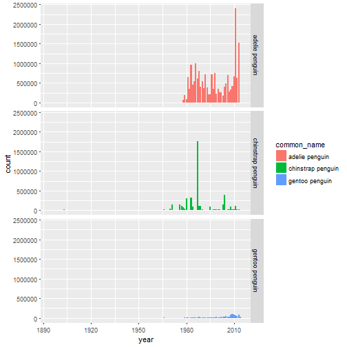

```r
ggplot(trainingSetObservations, aes(x=month, fill=common_name, weight=penguin_count)) +
    geom_bar() +
    facet_grid(common_name ~ .)
```

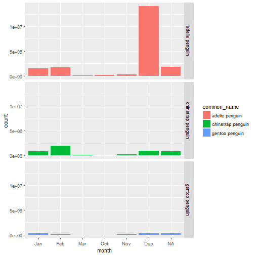

## Observation sites


```r
library(dplyr)
```

```
## 
## Attaching package: 'dplyr'
```

```
## The following objects are masked from 'package:stats':
## 
##     filter, lag
```

```
## The following objects are masked from 'package:base':
## 
##     intersect, setdiff, setequal, union
```

```r
library(magrittr)

locations <- trainingSetObservations %>%
    group_by(site_id, site_name, ccamlr_region, longitude_epsg_4326, latitude_epsg_4326, common_name) %>%
    summarise(total = sum(penguin_count))

worldmap + geom_point(aes(x=longitude_epsg_4326, y=latitude_epsg_4326, size=total, color=common_name),
                      inherit.aes = FALSE,
                      data = locations) +
    scale_size_continuous(range = c(0.5,10)) +
    geom_text(aes(x=longitude_epsg_4326, y=latitude_epsg_4326, label = site_id), data = locations,
              inherit.aes = FALSE,
              check_overlap = TRUE,
              hjust = 0, nudge_x = 0.05)
```


## Focus on Gentoo penguin


```r
gentooObs <- trainingSetObservations[trainingSetObservations$common_name == 'gentoo penguin',]
ggplot(gentooObs, aes(x=year, fill=common_name, weight=penguin_count)) +
    geom_bar()
```

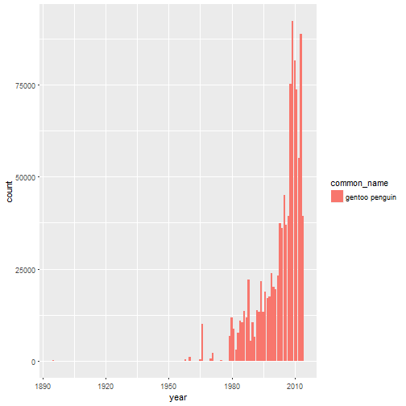

```r
gentooNest <- nestCount[nestCount$common_name == 'gentoo penguin',]
dim(gentooNest)
```

```
## [1] 104  57
```

```r
ggplot(gentooObs, aes(x=year, fill=common_name, weight=penguin_count)) +
    geom_bar()
```


```r
worldmap + geom_point(aes(x=longitude_epsg_4326, y=latitude_epsg_4326, size=total, color=common_name),
                      inherit.aes = FALSE,
                      data = locations %>% filter(common_name == 'gentoo penguin')) +
    scale_size_continuous(range = c(0.5,10)) +
    geom_text(aes(x=longitude_epsg_4326, y=latitude_epsg_4326, label = site_id),
              data = locations %>% filter(common_name == 'gentoo penguin') %>% arrange(desc(total)) %>% head(10),
              inherit.aes = FALSE,
              check_overlap = TRUE,
              hjust = 0, nudge_x = 0.05)
```


```r
gentooObs %>% group_by(site_id, count_type) %>% count() %>% arrange(desc(n))
```

```
## Source: local data frame [144 x 3]
## Groups: site_id [105]
## 
## # A tibble: 144 x 3
##    site_id count_type     n
##     <fctr>     <fctr> <int>
##  1    JOUG      nests    39
##  2    LLAN      nests    39
##  3    NEKO      nests    36
##  4    ALMI      nests    25
##  5    BROW      nests    24
##  6    BROW     chicks    20
##  7    DAMO      nests    20
##  8    PCHA      nests    20
##  9    PLEN      nests    20
## 10    BISC      nests    19
## # ... with 134 more rows
```

```r
ggplot(gentooObs %>% filter(year >= 1950), aes(x=year, y=penguin_count, color=vantage)) +
    geom_point() +
    geom_smooth() +
    facet_grid(count_type ~ .)
```

```
## `geom_smooth()` using method = 'loess'
```

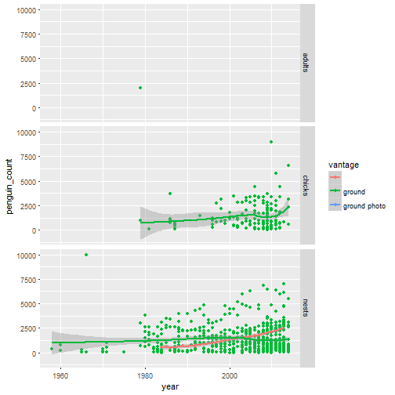

## Try to reproduce nest file


```r
library(reshape2)
(myNestCount <- trainingSetObservations %>%
     filter(! count_type %in% c('chicks', 'adults')) %>%
     group_by(site_id, common_name, year) %>%
     summarise(count = mean(penguin_count, na.rm=TRUE)) %>%
     dcast(site_id + common_name ~ paste0('X', year))) %>% head
```

```
## Using count as value column: use value.var to override.
```

```
##   site_id       common_name X1895 X1903 X1908 X1922 X1947 X1956 X1958
## 1    ACUN    adelie penguin    NA    NA    NA    NA    NA    NA    NA
## 2    ACUN chinstrap penguin    NA    NA    NA    NA    NA    NA    NA
## 3    ADAM    adelie penguin    NA    NA    NA    NA    NA    NA    NA
## 4    ADAR    adelie penguin    NA    NA    NA    NA    NA    NA    NA
## 5    AILS chinstrap penguin    NA    NA    NA    NA    NA    NA    NA
## 6    AITC chinstrap penguin    NA    NA    NA    NA    NA    NA    NA
##   X1960 X1965 X1966 X1967 X1970 X1971 X1975 X1976 X1977 X1978 X1979 X1980
## 1    NA    NA    NA    NA    NA    NA    NA    NA    NA    NA    NA    NA
## 2    NA    NA    NA    NA    NA    NA    NA    NA    NA    NA    NA    NA
## 3    NA    NA    NA    NA    NA    NA    NA    NA    NA    NA    NA    NA
## 4    NA    NA    NA    NA    NA    NA    NA    NA    NA    NA    NA    NA
## 5    NA    NA    NA    NA    NA    NA    NA    NA    NA    NA    NA    NA
## 6    NA    NA    NA    NA    NA    NA    NA    NA    NA    NA    NA    NA
##   X1981 X1982  X1983 X1984 X1985  X1986 X1987  X1988 X1989  X1990 X1991
## 1    NA    NA     NA    NA    NA     NA    NA     NA    NA     NA    NA
## 2    NA    NA   4000    NA    NA     NA    NA     NA    NA     NA    NA
## 3    NA    NA     NA    NA    NA     NA    NA     NA    NA     NA    NA
## 4    NA    NA 256806    NA    NA 282307    NA 272338    NA 169200    NA
## 5    NA    NA   6000    NA    NA     NA    NA     NA    NA     NA    NA
## 6    NA    NA     NA    NA    NA     NA    NA     NA    NA     NA    NA
##    X1992 X1993 X1994 X1995 X1996 X1997  X1998 X1999 X2000 X2001 X2002
## 1     NA  2008  1920    NA    NA    NA     NA    NA    NA    NA    NA
## 2     NA    NA    NA    NA    NA    NA     NA    NA    NA    NA    NA
## 3     NA    NA    NA    NA    NA    NA     NA    NA    NA    NA    NA
## 4 297443    NA    NA    NA    NA    NA 338777    NA    NA    NA    NA
## 5     NA    NA    NA    NA    NA    NA     NA    NA    NA    NA    NA
## 6     NA    NA    NA    NA    NA  4608     NA    NA    NA    NA    NA
##   X2003 X2004 X2005 X2006 X2007 X2008 X2009 X2010  X2011 X2012  X2013
## 1    NA  1880    NA    NA    NA    NA    NA    NA   3079    NA     NA
## 2    NA    NA    NA    NA    NA    NA    NA    NA     NA    NA     NA
## 3    NA    NA    NA    NA    NA    NA    76    NA     NA    NA     NA
## 4    NA    NA    NA    NA    NA    NA    NA    NA 338231    NA 428516
## 5    NA    NA    NA    NA    NA    NA    NA    NA     NA    NA     NA
## 6    NA    NA    NA    NA    NA  5620    NA    NA   4047    NA     NA
##   X2014
## 1    NA
## 2    NA
## 3    NA
## 4    NA
## 5    NA
## 6    NA
```

## Common functions


```r
penguinPoi <- function(species) {
    locations %>% filter(common_name == species) %>% arrange(desc(total)) %>% head(5)
}

penguinPlot <- function(species, poi) {
    ggplot(trainingSetObservations %>%
           filter(common_name == species) %>%
           filter(year >= 1950) %>%
           filter(site_id %in% poi$site_id),
           aes(x=year, y=penguin_count, color=vantage)) +
        geom_point() +
        geom_smooth() +
        facet_grid(count_type + site_id ~ ., scales = 'free_y') +
        labs(title=paste('Evolution for', species))
}
```

## Interesting sites (gentoo)


```r
poi <- penguinPoi('gentoo penguin')
poi
```

```
## Source: local data frame [5 x 7]
## Groups: site_id, site_name, ccamlr_region, longitude_epsg_4326, latitude_epsg_4326 [5]
## 
## # A tibble: 5 x 7
##   site_id              site_name ccamlr_region longitude_epsg_4326
##    <fctr>                 <fctr>        <fctr>               <dbl>
## 1    LLAN            Llano Point          48.1            -58.4460
## 2    CUVE      Cuverville Island          48.1            -62.6260
## 3    JOUG           Jougla Point          48.1            -63.4932
## 4    ARDL          Ardley Island          48.1            -58.9330
## 5    DAMO Dorian Bay/Damoy Point          48.1            -63.4968
## # ... with 3 more variables: latitude_epsg_4326 <dbl>, common_name <fctr>,
## #   total <dbl>
```

```r
penguinPlot('gentoo penguin', poi)
```

```
## `geom_smooth()` using method = 'loess'
```

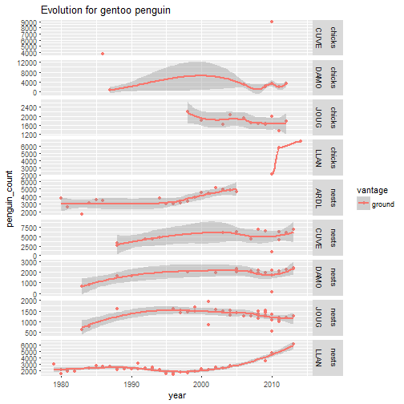

## Interesting sites (adelie penguin)


```r
poi <- penguinPoi('adelie penguin')
poi
```

```
## Source: local data frame [5 x 7]
## Groups: site_id, site_name, ccamlr_region, longitude_epsg_4326, latitude_epsg_4326 [5]
## 
## # A tibble: 5 x 7
##   site_id       site_name ccamlr_region longitude_epsg_4326
##    <fctr>          <fctr>        <fctr>               <dbl>
## 1    CROZ    Cape Crozier          88.1            169.3200
## 2    ADAR      Cape Adare          88.1            170.1999
## 3    BRDN Cape Bird North          88.1            166.4459
## 4    BEAU Beaufort Island          88.1            166.8978
## 5    CHAL    Cape Hallett          88.1            170.2142
## # ... with 3 more variables: latitude_epsg_4326 <dbl>, common_name <fctr>,
## #   total <dbl>
```

```r
penguinPlot('adelie penguin', poi)
```

```
## `geom_smooth()` using method = 'loess'
```

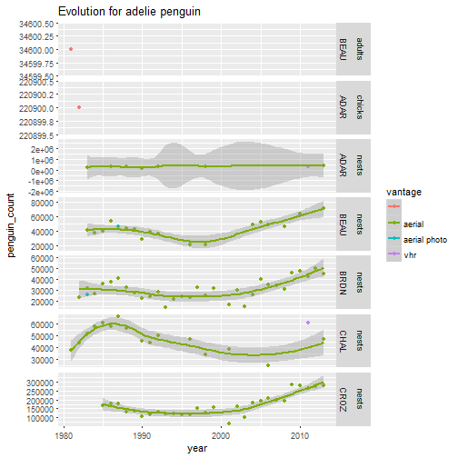

## Interesting sites (chinstrap penguin)


```r
poi <- penguinPoi('chinstrap penguin')
poi
```

```
## Source: local data frame [5 x 7]
## Groups: site_id, site_name, ccamlr_region, longitude_epsg_4326, latitude_epsg_4326 [5]
## 
## # A tibble: 5 x 7
##   site_id                     site_name ccamlr_region longitude_epsg_4326
##    <fctr>                        <fctr>        <fctr>               <dbl>
## 1    HARM                 Harmony Point          48.1            -59.2425
## 2    BAIL Baily Head (Deception Island)          48.1            -60.5060
## 3    SAND                Sandefjord Bay          48.2            -46.0367
## 4    POPO               Pottinger Point          48.1            -58.3582
## 5    WALL                  Cape Wallace          48.1            -62.2090
## # ... with 3 more variables: latitude_epsg_4326 <dbl>, common_name <fctr>,
## #   total <dbl>
```

```r
penguinPlot('chinstrap penguin', poi)
```

```
## `geom_smooth()` using method = 'loess'
```

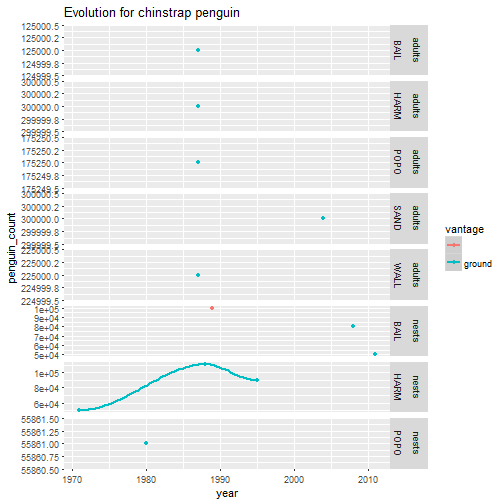

## Interesting sites (all species)


```r
soi <- c('ACUN',
         'AMBU',
         'BACK',
         'BEAN',
         'BIEN',
         'ADAM',
         'AKAR')
```

## Missing data


```r
library(reshape2)
nestCountMelt <- melt(myNestCount, id.vars=c('site_id', 'common_name'))

(nestCountBySiteAndSpecies <- nestCountMelt  %>%
    dcast(site_id + variable ~ common_name, sum) %>%
    group_by(site_id) %>%
    summarise(`adelie penguin`=sum(`adelie penguin`, na.rm=TRUE),
              `chinstrap penguin`=sum(`chinstrap penguin`, na.rm=TRUE),
              `gentoo penguin`=sum(`gentoo penguin`, na.rm=TRUE)) %>%
    mutate(total = `adelie penguin` + `chinstrap penguin` + `gentoo penguin`))
```

```
## # A tibble: 547 x 5
##    site_id `adelie penguin` `chinstrap penguin`
##     <fctr>            <dbl>               <dbl>
##  1    ACUN             8887                4000
##  2    ADAM               76                   0
##  3    ADAR          2383618                   0
##  4    AILS                0                6000
##  5    AITC                0               14275
##  6    AITK                0                3300
##  7    AKAR              106                   0
##  8    ALAS             1080                   0
##  9    ALCO                0                5721
## 10    ALMI                0                   0
## # ... with 537 more rows, and 2 more variables: `gentoo penguin` <dbl>,
## #   total <dbl>
```

```r
(nestCountByYear <- nestCountMelt %>%
    dcast(site_id + variable ~ common_name, sum) %>%
    group_by(variable) %>%
    summarise(`adelie penguin`=sum(`adelie penguin`, na.rm=TRUE),
              `chinstrap penguin`=sum(`chinstrap penguin`, na.rm=TRUE),
              `gentoo penguin`=sum(`gentoo penguin`, na.rm=TRUE)) %>%
     mutate(total = `adelie penguin` + `chinstrap penguin` + `gentoo penguin`) %>%
     melt(id.vars=c('variable'), variable.name='common_name', value.name='countByYear'))
```

```
##     variable       common_name countByYear
## 1      X1895    adelie penguin       0.000
## 2      X1903    adelie penguin       0.000
## 3      X1908    adelie penguin       0.000
## 4      X1922    adelie penguin       0.000
## 5      X1947    adelie penguin       0.000
## 6      X1956    adelie penguin       0.000
## 7      X1958    adelie penguin       0.000
## 8      X1960    adelie penguin    2475.000
## 9      X1965    adelie penguin       0.000
## 10     X1966    adelie penguin       0.000
## 11     X1967    adelie penguin       0.000
## 12     X1970    adelie penguin       0.000
## 13     X1971    adelie penguin       0.000
## 14     X1975    adelie penguin       0.000
## 15     X1976    adelie penguin      60.000
## 16     X1977    adelie penguin       0.000
## 17     X1978    adelie penguin   69928.000
## 18     X1979    adelie penguin  161308.500
## 19     X1980    adelie penguin   70990.000
## 20     X1981    adelie penguin  500169.000
## 21     X1982    adelie penguin   86465.000
## 22     X1983    adelie penguin  838627.000
## 23     X1984    adelie penguin  370607.000
## 24     X1985    adelie penguin  538619.000
## 25     X1986    adelie penguin  984671.500
## 26     X1987    adelie penguin  615271.000
## 27     X1988    adelie penguin  790477.500
## 28     X1989    adelie penguin  401760.500
## 29     X1990    adelie penguin  523915.500
## 30     X1991    adelie penguin  362444.500
## 31     X1992    adelie penguin  694429.000
## 32     X1993    adelie penguin  373315.500
## 33     X1994    adelie penguin  188457.000
## 34     X1995    adelie penguin  187429.200
## 35     X1996    adelie penguin  666021.000
## 36     X1997    adelie penguin  331268.000
## 37     X1998    adelie penguin  741607.000
## 38     X1999    adelie penguin  217640.000
## 39     X2000    adelie penguin  321863.000
## 40     X2001    adelie penguin  253608.000
## 41     X2002    adelie penguin  259127.000
## 42     X2003    adelie penguin  148163.000
## 43     X2004    adelie penguin  384204.000
## 44     X2005    adelie penguin  493920.000
## 45     X2006    adelie penguin  706200.000
## 46     X2007    adelie penguin  263492.000
## 47     X2008    adelie penguin  311259.500
## 48     X2009    adelie penguin  388960.500
## 49     X2010    adelie penguin  591978.500
## 50     X2011    adelie penguin 2382038.500
## 51     X2012    adelie penguin  626440.000
## 52     X2013    adelie penguin 1436067.167
## 53     X2014    adelie penguin    2813.000
## 54     X1895 chinstrap penguin       0.000
## 55     X1903 chinstrap penguin       0.000
## 56     X1908 chinstrap penguin       0.000
## 57     X1922 chinstrap penguin       0.000
## 58     X1947 chinstrap penguin       0.000
## 59     X1956 chinstrap penguin    5000.000
## 60     X1958 chinstrap penguin       0.000
## 61     X1960 chinstrap penguin       0.000
## 62     X1965 chinstrap penguin    8000.000
## 63     X1966 chinstrap penguin   24500.000
## 64     X1967 chinstrap penguin    1100.000
## 65     X1970 chinstrap penguin   39350.000
## 66     X1971 chinstrap penguin  153826.000
## 67     X1975 chinstrap penguin       1.000
## 68     X1976 chinstrap penguin  146550.000
## 69     X1977 chinstrap penguin  112521.000
## 70     X1978 chinstrap penguin   32769.000
## 71     X1979 chinstrap penguin   22688.000
## 72     X1980 chinstrap penguin  302170.500
## 73     X1981 chinstrap penguin    5244.000
## 74     X1982 chinstrap penguin     280.000
## 75     X1983 chinstrap penguin  309151.000
## 76     X1984 chinstrap penguin   87538.500
## 77     X1985 chinstrap penguin    6230.333
## 78     X1986 chinstrap penguin   11105.000
## 79     X1987 chinstrap penguin   43557.000
## 80     X1988 chinstrap penguin  115468.000
## 81     X1989 chinstrap penguin  107102.000
## 82     X1990 chinstrap penguin   28569.000
## 83     X1991 chinstrap penguin    1747.000
## 84     X1992 chinstrap penguin    5781.000
## 85     X1993 chinstrap penguin    2428.000
## 86     X1994 chinstrap penguin    7409.000
## 87     X1995 chinstrap penguin   94032.000
## 88     X1996 chinstrap penguin    8134.000
## 89     X1997 chinstrap penguin   13869.000
## 90     X1998 chinstrap penguin   15018.500
## 91     X1999 chinstrap penguin   13801.500
## 92     X2000 chinstrap penguin   15447.000
## 93     X2001 chinstrap penguin   10116.000
## 94     X2002 chinstrap penguin    6249.000
## 95     X2003 chinstrap penguin  147166.000
## 96     X2004 chinstrap penguin    5948.000
## 97     X2005 chinstrap penguin    6203.000
## 98     X2006 chinstrap penguin   18720.000
## 99     X2007 chinstrap penguin    8855.000
## 100    X2008 chinstrap penguin   94856.000
## 101    X2009 chinstrap penguin   11400.750
## 102    X2010 chinstrap penguin   19720.833
## 103    X2011 chinstrap penguin  100106.000
## 104    X2012 chinstrap penguin   15144.000
## 105    X2013 chinstrap penguin   13211.667
## 106    X2014 chinstrap penguin    1646.000
## 107    X1895    gentoo penguin      40.000
## 108    X1903    gentoo penguin       0.000
## 109    X1908    gentoo penguin       0.000
## 110    X1922    gentoo penguin       0.000
## 111    X1947    gentoo penguin       0.000
## 112    X1956    gentoo penguin       0.000
## 113    X1958    gentoo penguin     400.000
## 114    X1960    gentoo penguin    1000.000
## 115    X1965    gentoo penguin     268.000
## 116    X1966    gentoo penguin   10045.000
## 117    X1967    gentoo penguin       0.000
## 118    X1970    gentoo penguin     580.000
## 119    X1971    gentoo penguin    2020.000
## 120    X1975    gentoo penguin      54.000
## 121    X1976    gentoo penguin       0.000
## 122    X1977    gentoo penguin       0.000
## 123    X1978    gentoo penguin       0.000
## 124    X1979    gentoo penguin    3703.000
## 125    X1980    gentoo penguin    9942.500
## 126    X1981    gentoo penguin    6638.000
## 127    X1982    gentoo penguin    2872.000
## 128    X1983    gentoo penguin    7522.000
## 129    X1984    gentoo penguin   10868.500
## 130    X1985    gentoo penguin   10378.000
## 131    X1986    gentoo penguin    6817.000
## 132    X1987    gentoo penguin    8968.000
## 133    X1988    gentoo penguin   17021.000
## 134    X1989    gentoo penguin    3067.500
## 135    X1990    gentoo penguin    8159.000
## 136    X1991    gentoo penguin    3718.000
## 137    X1992    gentoo penguin   10330.000
## 138    X1993    gentoo penguin    9403.000
## 139    X1994    gentoo penguin   19513.500
## 140    X1995    gentoo penguin   11596.000
## 141    X1996    gentoo penguin   14033.500
## 142    X1997    gentoo penguin   11222.000
## 143    X1998    gentoo penguin   11200.000
## 144    X1999    gentoo penguin   20027.000
## 145    X2000    gentoo penguin   15700.000
## 146    X2001    gentoo penguin   12378.500
## 147    X2002    gentoo penguin   16629.000
## 148    X2003    gentoo penguin   28151.500
## 149    X2004    gentoo penguin   22333.833
## 150    X2005    gentoo penguin   32060.333
## 151    X2006    gentoo penguin   16394.500
## 152    X2007    gentoo penguin   28363.000
## 153    X2008    gentoo penguin   36803.150
## 154    X2009    gentoo penguin   43264.750
## 155    X2010    gentoo penguin   36515.167
## 156    X2011    gentoo penguin   33121.767
## 157    X2012    gentoo penguin   29382.000
## 158    X2013    gentoo penguin   52378.867
## 159    X2014    gentoo penguin   19134.167
## 160    X1895             total      40.000
## 161    X1903             total       0.000
## 162    X1908             total       0.000
## 163    X1922             total       0.000
## 164    X1947             total       0.000
## 165    X1956             total    5000.000
## 166    X1958             total     400.000
## 167    X1960             total    3475.000
## 168    X1965             total    8268.000
## 169    X1966             total   34545.000
## 170    X1967             total    1100.000
## 171    X1970             total   39930.000
## 172    X1971             total  155846.000
## 173    X1975             total      55.000
## 174    X1976             total  146610.000
## 175    X1977             total  112521.000
## 176    X1978             total  102697.000
## 177    X1979             total  187699.500
## 178    X1980             total  383103.000
## 179    X1981             total  512051.000
## 180    X1982             total   89617.000
## 181    X1983             total 1155300.000
## 182    X1984             total  469014.000
## 183    X1985             total  555227.333
## 184    X1986             total 1002593.500
## 185    X1987             total  667796.000
## 186    X1988             total  922966.500
## 187    X1989             total  511930.000
## 188    X1990             total  560643.500
## 189    X1991             total  367909.500
## 190    X1992             total  710540.000
## 191    X1993             total  385146.500
## 192    X1994             total  215379.500
## 193    X1995             total  293057.200
## 194    X1996             total  688188.500
## 195    X1997             total  356359.000
## 196    X1998             total  767825.500
## 197    X1999             total  251468.500
## 198    X2000             total  353010.000
## 199    X2001             total  276102.500
## 200    X2002             total  282005.000
## 201    X2003             total  323480.500
## 202    X2004             total  412485.833
## 203    X2005             total  532183.333
## 204    X2006             total  741314.500
## 205    X2007             total  300710.000
## 206    X2008             total  442918.650
## 207    X2009             total  443626.000
## 208    X2010             total  648214.500
## 209    X2011             total 2515266.267
## 210    X2012             total  670966.000
## 211    X2013             total 1501657.700
## 212    X2014             total   23593.167
```

```r
(historicalData <- nestCountMelt %>% inner_join(nestCountByYear, by=c('common_name', 'variable')) %>%
     group_by(site_id, common_name, variable) %>%
     summarise(count = sum(value, na.rm=TRUE),
               countByYear = first(countByYear)) %>%
    mutate(ratio = count/countByYear) %>%
    arrange(desc(ratio)) %>%
    mutate(label=paste0(site_id, common_name)) %>%
    mutate(year=as.numeric(gsub('X', '', variable))))
```

```
## Source: local data frame [34,132 x 8]
## Groups: site_id, common_name [644]
## 
## # A tibble: 34,132 x 8
##    site_id       common_name variable count countByYear ratio
##     <fctr>             <chr>   <fctr> <dbl>       <dbl> <dbl>
##  1    BOWL    adelie penguin    X1976    60          60     1
##  2    BRUC chinstrap penguin    X1956  5000        5000     1
##  3    CARL chinstrap penguin    X1975     1           1     1
##  4    CVIK chinstrap penguin    X1965  8000        8000     1
##  5    DUND    gentoo penguin    X1895    40          40     1
##  6    ELPT    gentoo penguin    X1958   400         400     1
##  7    HALF chinstrap penguin    X1991  1747        1747     1
##  8    JOUB    gentoo penguin    X1975    54          54     1
##  9    LLAN chinstrap penguin    X1982   280         280     1
## 10    ORRO chinstrap penguin    X1967  1100        1100     1
## # ... with 34,122 more rows, and 2 more variables: label <chr>, year <dbl>
```

```r
(top25SiteBySpecies <- rbind(nestCountBySiteAndSpecies %>% melt(id.vars = 'site_id') %>%
                            filter(variable == 'adelie penguin') %>%
                            mutate(common_name='adelie penguin') %>%
                            arrange(desc(value)) %>%
                            head(25),
                            nestCountBySiteAndSpecies %>% melt(id.vars = 'site_id') %>%
                            filter(variable == 'gentoo penguin') %>%
                            mutate(common_name='gentoo penguin') %>%
                            arrange(desc(value)) %>%
                            head(25),
                            nestCountBySiteAndSpecies %>% melt(id.vars = 'site_id') %>%
                            filter(variable == 'chinstrap penguin') %>%
                            mutate(common_name='chinstrap penguin') %>%
                            arrange(desc(value)) %>%
                            head(25)))
```

```
##    site_id          variable      value       common_name
## 1     CROZ    adelie penguin 4741939.00    adelie penguin
## 2     ADAR    adelie penguin 2383618.00    adelie penguin
## 3     BRDN    adelie penguin  971727.00    adelie penguin
## 4     CHAL    adelie penguin  826623.00    adelie penguin
## 5     BEAU    adelie penguin  773097.00    adelie penguin
## 6     POSS    adelie penguin  676255.00    adelie penguin
## 7     FRAW    adelie penguin  571221.00    adelie penguin
## 8     COTT    adelie penguin  387441.00    adelie penguin
## 9     INEX    adelie penguin  361392.00    adelie penguin
## 10    BRDS    adelie penguin  356511.00    adelie penguin
## 11    SVEN    adelie penguin  332076.00    adelie penguin
## 12    PAUL    adelie penguin  285119.00    adelie penguin
## 13    HERO    adelie penguin  276938.00    adelie penguin
## 14    HOPE    adelie penguin  240945.00    adelie penguin
## 15    VESS    adelie penguin  233346.00    adelie penguin
## 16    RAUE    adelie penguin  218950.00    adelie penguin
## 17    DOWN    adelie penguin  211918.00    adelie penguin
## 18    CSOU    adelie penguin  184753.00    adelie penguin
## 19    LLAN    adelie penguin  177767.50    adelie penguin
## 20    BRAS    adelie penguin  166078.00    adelie penguin
## 21    NORF    adelie penguin  158920.00    adelie penguin
## 22    FERR    adelie penguin  134988.00    adelie penguin
## 23    PTHO    adelie penguin  129201.00    adelie penguin
## 24    MAND    adelie penguin  121514.00    adelie penguin
## 25    AVIA    adelie penguin  113115.00    adelie penguin
## 26    LLAN    gentoo penguin   69909.00    gentoo penguin
## 27    ARDL    gentoo penguin   66656.00    gentoo penguin
## 28    CUVE    gentoo penguin   65650.50    gentoo penguin
## 29    YANK    gentoo penguin   39020.00    gentoo penguin
## 30    JOUG    gentoo penguin   26237.60    gentoo penguin
## 31    PLEN    gentoo penguin   26230.00    gentoo penguin
## 32    PETE    gentoo penguin   25394.50    gentoo penguin
## 33    DANC    gentoo penguin   25280.83    gentoo penguin
## 34    DAMO    gentoo penguin   24775.50    gentoo penguin
## 35    BART    gentoo penguin   23184.00    gentoo penguin
## 36    GEOR    gentoo penguin   19900.17    gentoo penguin
## 37    LION    gentoo penguin   17760.00    gentoo penguin
## 38    BISC    gentoo penguin   15889.00    gentoo penguin
## 39    WATE    gentoo penguin   15533.50    gentoo penguin
## 40    AITC    gentoo penguin   15325.00    gentoo penguin
## 41    NEKO    gentoo penguin   15280.83    gentoo penguin
## 42    STRA    gentoo penguin   11893.00    gentoo penguin
## 43    SHIR    gentoo penguin   10730.00    gentoo penguin
## 44    PCHA    gentoo penguin   10571.58    gentoo penguin
## 45    RIPP    gentoo penguin   10000.00    gentoo penguin
## 46    CIER    gentoo penguin    9129.00    gentoo penguin
## 47    STER    gentoo penguin    7455.00    gentoo penguin
## 48    HARM    gentoo penguin    7304.00    gentoo penguin
## 49    BRYS    gentoo penguin    6361.50    gentoo penguin
## 50    PYPT    gentoo penguin    6189.00    gentoo penguin
## 51    HARM chinstrap penguin  250560.00 chinstrap penguin
## 52    BAIL chinstrap penguin  230408.00 chinstrap penguin
## 53    SPIN chinstrap penguin  125000.00 chinstrap penguin
## 54    SHIR chinstrap penguin   77733.00 chinstrap penguin
## 55    FURS chinstrap penguin   70450.00 chinstrap penguin
## 56    PPPT chinstrap penguin   58500.00 chinstrap penguin
## 57    POPO chinstrap penguin   55861.00 chinstrap penguin
## 58    FRPT chinstrap penguin   49410.00 chinstrap penguin
## 59    BART chinstrap penguin   44765.33 chinstrap penguin
## 60    FRED chinstrap penguin   40820.00 chinstrap penguin
## 61    BOWL chinstrap penguin   33000.00 chinstrap penguin
## 62    CROB chinstrap penguin   32000.00 chinstrap penguin
## 63    KELL chinstrap penguin   26890.00 chinstrap penguin
## 64    PENG chinstrap penguin   26014.50 chinstrap penguin
## 65    CCMP chinstrap penguin   24480.00 chinstrap penguin
## 66    NFOR chinstrap penguin   23286.00 chinstrap penguin
## 67    HEYW chinstrap penguin   23000.00 chinstrap penguin
## 68    MORE chinstrap penguin   23000.00 chinstrap penguin
## 69    CHEA chinstrap penguin   22500.00 chinstrap penguin
## 70    HALF chinstrap penguin   22249.50 chinstrap penguin
## 71    OWEN chinstrap penguin   21551.00 chinstrap penguin
## 72    ELLI chinstrap penguin   21400.00 chinstrap penguin
## 73    OBRI chinstrap penguin   21400.00 chinstrap penguin
## 74    CHIN chinstrap penguin   20701.00 chinstrap penguin
## 75    TART chinstrap penguin   20494.00 chinstrap penguin
```

```r
top25BySpecies <- historicalData %>%
    inner_join(top25SiteBySpecies, by=c('site_id', 'common_name'))

ggplot(data=top25BySpecies, aes(x=year, y=site_id)) +
    geom_tile(aes(fill=ratio)) +
    facet_grid(common_name ~ ., scales = 'free_y')
```

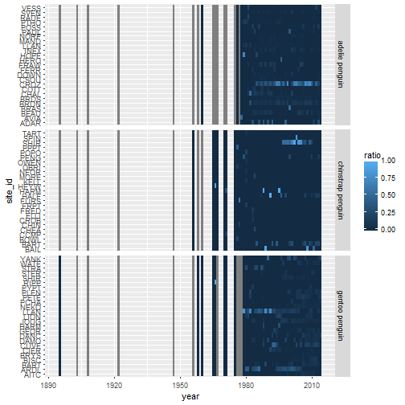

```r
sum(is.na(myNestCount))
```

```
## [1] 32177
```

# Model

One linear model by site/species


```r
library(caret)
```

```
## Loading required package: lattice
```

```r
library(e1071)
library(ModelMetrics)
```

```
## 
## Attaching package: 'ModelMetrics'
```

```
## The following objects are masked from 'package:caret':
## 
##     confusionMatrix, precision, recall, sensitivity, specificity
```

```r
library(parallel)
library(foreach)
library(doParallel)
```

```
## Loading required package: iterators
```

```r
library(elasticnet)
```

```
## Loading required package: lars
```

```
## Loaded lars 1.2
```

```r
dataset <- myNestCount
dataset[is.na(dataset)] <- 0

registerDoParallel(cores=max(1, detectCores()-1))

pb <- txtProgressBar(min = 1, max = nrow(dataset), style = 3)
method <- 'lm'

system.time(models <- foreach(idx=1:nrow(dataset), .packages = c('caret', 'ModelMetrics')) %dopar% {
    ##for(idx in 1:10) {
    setTxtProgressBar(pb, idx)
    site_id <- dataset[idx, 'site_id']
    common_name <- dataset[idx, 'common_name']
    row <- c(dataset[idx,21:55])
    testSetRange <- (length(row) - 4):(length(row))
    maxTrainSetRange <- length(row) - 4
    years <- as.numeric(gsub('X', '', names(row)))
    testSet <- data.frame(year=years[testSetRange], value=unname(unlist(row[testSetRange])))
    bestFit <- NA
    bestLag <- 0
    bestError <- Inf
    partialErrors <- lapply(2:(maxTrainSetRange-1), function(i) {
        range <- (maxTrainSetRange-i):maxTrainSetRange
        trainSet <- data.frame(year=years[range],
                               value=unname(unlist(row[range])))
        possibleError <- tryCatch({
            fit <- train(value ~ year,
                         data=trainSet,
                         method=method,
                         trControl=trainControl(method='none'))
            preds <- predict(fit, testSet)
            error <- rmse(testSet$value, preds)
            if(error < bestError) {
                bestError <<- error
                bestLag <<- i
                bestFit <<- fit
            }
            list(bestError=bestError, bestLag=bestLag)
        }, error = function(e) {
            e
        })
        possibleError
    })
    range <- (maxTrainSetRange-bestLag):maxTrainSetRange
#    message(bestLag)
    trainSet <- rbind(data.frame(year=years[range],
                                 value=unlist(unname(row[range]))),
                      testSet)
    finalFit <- tryCatch({
        train(value ~ year,
              data=trainSet,
              method=method,
              trControl=trainControl(method='none'))},
        error=function (e) e)
    if(inherits(finalFit, "error")) {
        message(paste('Cannot train final Model'))
        list(site_id=site_id, common_name=common_name,
             partialErrors=partialErrors, error=finalFit)
    } else {
        list(site_id=site_id, common_name=common_name,
             fit=finalFit, bestLag=bestLag, bestError=bestError)
    }
})
```

```
##    user  system elapsed 
##    8.24    1.14  723.97
```

```r
close(pb)
```

```r
save(models, file=paste0('models-', method, '.RData'))
```

### Submission


```r
library(plyr)
```

```
## -------------------------------------------------------------------------
```

```
## You have loaded plyr after dplyr - this is likely to cause problems.
## If you need functions from both plyr and dplyr, please load plyr first, then dplyr:
## library(plyr); library(dplyr)
```

```
## -------------------------------------------------------------------------
```

```
## 
## Attaching package: 'plyr'
```

```
## The following objects are masked from 'package:dplyr':
## 
##     arrange, count, desc, failwith, id, mutate, rename, summarise,
##     summarize
```

```
## The following object is masked from 'package:maps':
## 
##     ozone
```

```r
yearsSubmission <- data.frame(year=2014:2017)

predictions <- ldply(models, function(model) {
    data.frame(site_id=model$site_id, common_name=model$common_name,
               year=yearsSubmission,
               preds=predict(model$fit, yearsSubmission))
}) %>%
    mutate(value=pmax(0, round(preds, digits=1))) %>%
    dcast(site_id + common_name ~ year) %>%
    right_join(submissionFormat, by=c('site_id', 'common_name')) %>%
    select(1:6) 
predictions[is.na(predictions)] <- 0


write.csv(predictions, file = 'submission.csv', row.names=FALSE, quote=FALSE)
```

## Second model with lag
## Timeseries with zoo


```r
library(zoo)
```

```
## 
## Attaching package: 'zoo'
```

```
## The following objects are masked from 'package:base':
## 
##     as.Date, as.Date.numeric
```

```r
library(forecast)

dataset <- myNestCount %>%
    filter(common_name == 'gentoo penguin') %>%
    filter(site_id == 'LLAN') %>%
    melt(id.var=c('site_id', 'common_name'), variable.name='year') %>%
    mutate(year=as.numeric(gsub('X', '', year)))

series <- zoo(dataset$value)
index(series) <- dataset$year

autoplot(na.approx(series)) + geom_smooth()
```

```
## `geom_smooth()` using method = 'loess'
```

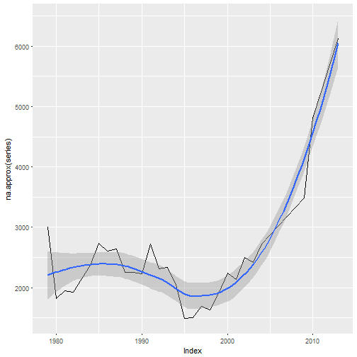

```r
autoplot(forecast(na.approx(series))) 
```

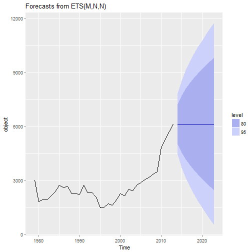

```r
autoplot(auto.arima(series))
```

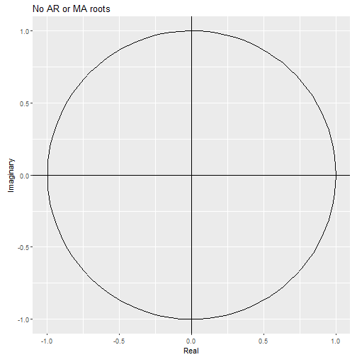

