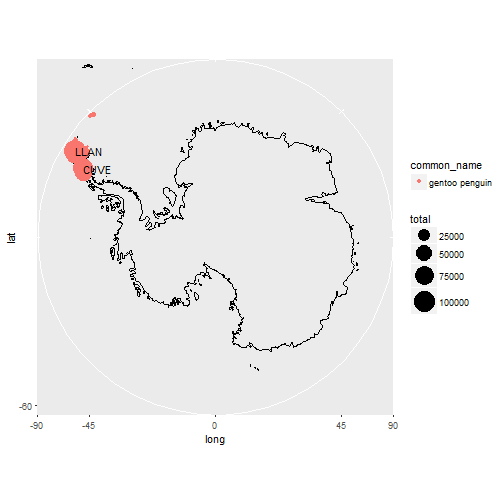

```r
library(knitr)
```

```
## Warning: package 'knitr' was built under R version 3.3.3
```

```r
opts_chunk$set(warning = FALSE)
```

# Penguin walk I
## Data loading


```r
dir.create('data', recursive = TRUE)

dataUrls <- c('https://s3.amazonaws.com/drivendata/data/47/public/training_set_observations.csv',
              'https://s3.amazonaws.com/drivendata/data/47/public/training_set_nest_counts.csv',
              'https://s3.amazonaws.com/drivendata/data/47/public/submission_format.csv',
              'https://s3.amazonaws.com/drivendata/data/47/public/training_set_e_n.csv')

sapply(dataUrls, function (url) {
    destfile <- paste('data', basename(url), sep='/')
    download.file(url, destfile = destfile)
    c(destfile = file.info(destfile)['size'])
})
```

```
## $`https://s3.amazonaws.com/drivendata/data/47/public/training_set_observations.csv.destfile.size`
## [1] 331605
## 
## $`https://s3.amazonaws.com/drivendata/data/47/public/training_set_nest_counts.csv.destfile.size`
## [1] 61364
## 
## $`https://s3.amazonaws.com/drivendata/data/47/public/submission_format.csv.destfile.size`
## [1] 24866
## 
## $`https://s3.amazonaws.com/drivendata/data/47/public/training_set_e_n.csv.destfile.size`
## [1] 57276
```

```r
submissionFormat <- read.csv('data/submission_format.csv')
trainingSetError <- read.csv('data/training_set_e_n.csv')
nestCount <- read.csv('data/training_set_nest_counts.csv')
trainingSetObservations <- read.csv('data/training_set_observations.csv')

str(nestCount)
```

```
## 'data.frame':	648 obs. of  57 variables:
##  $ site_id    : Factor w/ 548 levels "ACUN","ADAM",..: 1 1 2 3 4 5 5 6 7 8 ...
##  $ common_name: Factor w/ 3 levels "adelie penguin",..: 1 2 1 1 2 2 3 2 1 1 ...
##  $ X1895      : num  NA NA NA NA NA NA NA NA NA NA ...
##  $ X1903      : logi  NA NA NA NA NA NA ...
##  $ X1908      : logi  NA NA NA NA NA NA ...
##  $ X1921      : logi  NA NA NA NA NA NA ...
##  $ X1947      : logi  NA NA NA NA NA NA ...
##  $ X1956      : num  NA NA NA NA NA NA NA NA NA NA ...
##  $ X1957      : num  NA NA NA NA NA NA NA NA NA NA ...
##  $ X1959      : num  NA NA NA NA NA NA NA NA NA NA ...
##  $ X1960      : num  NA NA NA NA NA NA NA NA NA NA ...
##  $ X1964      : num  NA NA NA NA NA NA NA NA NA NA ...
##  $ X1965      : num  NA NA NA NA NA NA NA NA NA NA ...
##  $ X1966      : num  NA NA NA NA NA NA NA NA NA NA ...
##  $ X1969      : num  NA NA NA NA NA NA NA NA NA NA ...
##  $ X1970      : num  NA NA NA NA NA NA NA NA NA NA ...
##  $ X1971      : num  NA NA NA NA NA NA NA NA NA NA ...
##  $ X1974      : num  NA NA NA NA NA NA NA NA NA NA ...
##  $ X1975      : num  NA NA NA NA NA NA NA NA NA NA ...
##  $ X1976      : num  NA NA NA NA NA NA NA NA NA NA ...
##  $ X1977      : num  NA NA NA NA NA NA NA NA NA NA ...
##  $ X1978      : num  NA NA NA NA NA NA NA NA NA NA ...
##  $ X1979      : num  NA NA NA NA NA NA NA NA NA NA ...
##  $ X1980      : num  NA NA NA NA NA NA NA NA NA NA ...
##  $ X1981      : num  NA NA NA NA NA NA NA NA NA NA ...
##  $ X1982      : num  NA NA NA NA NA NA NA NA NA NA ...
##  $ X1983      : num  NA 4000 NA 256806 6000 ...
##  $ X1984      : num  NA NA NA NA NA NA NA NA NA NA ...
##  $ X1985      : num  NA NA NA NA NA NA NA NA NA NA ...
##  $ X1986      : num  NA NA NA 282307 NA ...
##  $ X1987      : num  NA NA NA NA NA NA NA NA NA NA ...
##  $ X1988      : num  NA NA NA 272338 NA ...
##  $ X1989      : num  NA NA NA NA NA NA NA NA NA NA ...
##  $ X1990      : num  NA NA NA 169200 NA ...
##  $ X1991      : num  NA NA NA NA NA NA NA NA NA NA ...
##  $ X1992      : num  NA NA NA 297443 NA ...
##  $ X1993      : num  2008 NA NA NA NA ...
##  $ X1994      : num  1920 NA NA NA NA NA NA NA NA NA ...
##  $ X1995      : num  NA NA NA NA NA NA NA NA NA NA ...
##  $ X1996      : num  NA NA NA NA NA NA NA NA NA NA ...
##  $ X1997      : num  NA NA NA NA NA ...
##  $ X1998      : num  NA NA NA 338777 NA ...
##  $ X1999      : num  NA NA NA NA NA ...
##  $ X2000      : num  NA NA NA NA NA NA NA NA NA NA ...
##  $ X2001      : num  NA NA NA NA NA NA NA NA NA NA ...
##  $ X2002      : num  NA NA NA NA NA NA NA NA NA NA ...
##  $ X2003      : num  NA NA NA NA NA ...
##  $ X2004      : num  1880 NA NA NA NA NA NA NA NA NA ...
##  $ X2005      : num  NA NA NA NA NA ...
##  $ X2006      : num  NA NA NA NA NA ...
##  $ X2007      : num  NA NA NA NA NA ...
##  $ X2008      : num  NA NA NA NA NA 5620 2210 NA NA 1080 ...
##  $ X2009      : num  NA NA 76 NA NA NA 1900 NA NA NA ...
##  $ X2010      : num  3079 NA NA 338231 NA ...
##  $ X2011      : num  NA NA NA NA NA ...
##  $ X2012      : num  NA NA NA NA NA NA NA NA NA NA ...
##  $ X2013      : num  NA NA NA 428516 NA ...
```

```r
str(trainingSetError)
```

```
## 'data.frame':	648 obs. of  57 variables:
##  $ site_id    : Factor w/ 548 levels "ACUN","ADAM",..: 1 1 2 3 4 5 5 6 7 8 ...
##  $ common_name: Factor w/ 3 levels "adelie penguin",..: 1 2 1 1 2 2 3 2 1 1 ...
##  $ X1895      : num  NA NA NA NA NA NA NA NA NA NA ...
##  $ X1903      : logi  NA NA NA NA NA NA ...
##  $ X1908      : logi  NA NA NA NA NA NA ...
##  $ X1921      : logi  NA NA NA NA NA NA ...
##  $ X1947      : logi  NA NA NA NA NA NA ...
##  $ X1956      : num  NA NA NA NA NA NA NA NA NA NA ...
##  $ X1957      : num  NA NA NA NA NA NA NA NA NA NA ...
##  $ X1959      : num  NA NA NA NA NA NA NA NA NA NA ...
##  $ X1960      : num  NA NA NA NA NA NA NA NA NA NA ...
##  $ X1964      : num  NA NA NA NA NA NA NA NA NA NA ...
##  $ X1965      : num  NA NA NA NA NA NA NA NA NA NA ...
##  $ X1966      : num  NA NA NA NA NA NA NA NA NA NA ...
##  $ X1969      : num  NA NA NA NA NA NA NA NA NA NA ...
##  $ X1970      : num  NA NA NA NA NA NA NA NA NA NA ...
##  $ X1971      : num  NA NA NA NA NA NA NA NA NA NA ...
##  $ X1974      : num  NA NA NA NA NA NA NA NA NA NA ...
##  $ X1975      : num  NA NA NA NA NA NA NA NA NA NA ...
##  $ X1976      : num  NA NA NA NA NA NA NA NA NA NA ...
##  $ X1977      : num  NA NA NA NA NA NA NA NA NA NA ...
##  $ X1978      : num  NA NA NA NA NA NA NA NA NA NA ...
##  $ X1979      : num  NA NA NA NA NA NA NA NA NA NA ...
##  $ X1980      : num  NA NA NA NA NA NA NA NA NA NA ...
##  $ X1981      : num  NA NA NA NA NA NA NA NA NA NA ...
##  $ X1982      : num  NA NA NA NA NA NA NA NA NA NA ...
##  $ X1983      : num  NA 0.5 NA 0.1 0.5 NA NA 0.5 NA NA ...
##  $ X1984      : num  NA NA NA NA NA NA NA NA NA NA ...
##  $ X1985      : num  NA NA NA NA NA NA NA NA NA NA ...
##  $ X1986      : num  NA NA NA 0.1 NA NA NA NA NA NA ...
##  $ X1987      : num  NA NA NA NA NA NA NA NA NA NA ...
##  $ X1988      : num  NA NA NA 0.1 NA NA NA NA NA NA ...
##  $ X1989      : num  NA NA NA NA NA NA NA NA NA NA ...
##  $ X1990      : num  NA NA NA 0.1 NA NA NA NA NA NA ...
##  $ X1991      : num  NA NA NA NA NA NA NA NA NA NA ...
##  $ X1992      : num  NA NA NA 0.1 NA NA NA NA NA NA ...
##  $ X1993      : num  0.05 NA NA NA NA NA NA NA NA NA ...
##  $ X1994      : num  0.05 NA NA NA NA NA NA NA NA NA ...
##  $ X1995      : num  NA NA NA NA NA NA NA NA NA NA ...
##  $ X1996      : num  NA NA NA NA NA NA NA NA NA NA ...
##  $ X1997      : num  NA NA NA NA NA 0.05 NA NA NA NA ...
##  $ X1998      : num  NA NA NA 0.1 NA NA NA NA NA NA ...
##  $ X1999      : num  NA NA NA NA NA NA 0.05 NA NA NA ...
##  $ X2000      : num  NA NA NA NA NA NA NA NA NA NA ...
##  $ X2001      : num  NA NA NA NA NA NA NA NA NA NA ...
##  $ X2002      : num  NA NA NA NA NA NA NA NA NA NA ...
##  $ X2003      : num  NA NA NA NA NA NA 0.05 NA NA NA ...
##  $ X2004      : num  0.05 NA NA NA NA NA NA NA NA NA ...
##  $ X2005      : num  NA NA NA NA NA NA 0.05 NA NA NA ...
##  $ X2006      : num  NA NA NA NA NA NA 0.05 NA NA NA ...
##  $ X2007      : num  NA NA NA NA NA NA 0.05 NA NA NA ...
##  $ X2008      : num  NA NA NA NA NA 0.05 0.05 NA NA 0.9 ...
##  $ X2009      : num  NA NA 0.9 NA NA NA 0.05 NA NA NA ...
##  $ X2010      : num  0.9 NA NA 0.9 NA NA 0.05 NA 0.9 NA ...
##  $ X2011      : num  NA NA NA NA NA 0.05 0.05 NA NA NA ...
##  $ X2012      : num  NA NA NA NA NA NA NA NA NA NA ...
##  $ X2013      : num  NA NA NA 0.1 NA NA NA NA NA NA ...
```

```r
str(trainingSetObservations)
```

```
## 'data.frame':	2952 obs. of  16 variables:
##  $ X                  : int  0 1 2 3 4 5 6 7 8 9 ...
##  $ site_name          : Factor w/ 619 levels "Acuna Island",..: 1 1 1 1 1 2 2 66 66 66 ...
##  $ site_id            : Factor w/ 619 levels "ACUN","ADAM",..: 1 1 1 1 1 2 2 3 3 3 ...
##  $ ccamlr_region      : Factor w/ 7 levels "48.1","48.2",..: 2 2 2 2 2 3 3 5 5 5 ...
##  $ longitude_epsg_4326: num  -44.6 -44.6 -44.6 -44.6 -44.6 ...
##  $ latitude_epsg_4326 : num  -60.8 -60.8 -60.8 -60.8 -60.8 ...
##  $ common_name        : Factor w/ 3 levels "adelie penguin",..: 2 1 1 1 1 1 1 1 1 1 ...
##  $ day                : num  28 NA NA NA 25 12 21 NA NA NA ...
##  $ month              : num  12 NA NA NA 2 11 1 NA 12 12 ...
##  $ year               : int  1983 1993 1994 2004 2011 2009 2011 1982 1983 1986 ...
##  $ season_starting    : int  1983 1993 1994 2004 2010 2009 2010 1982 1983 1986 ...
##  $ penguin_count      : num  4000 2008 1920 1880 3079 ...
##  $ accuracy           : num  4 1 1 1 5 5 1 2 2 2 ...
##  $ count_type         : Factor w/ 3 levels "adults","chicks",..: 3 3 3 3 3 3 1 2 3 3 ...
##  $ vantage            : Factor w/ 8 levels "","aerial","aerial photo",..: 4 4 1 4 8 8 3 1 2 2 ...
##  $ e_n                : num  0.5 0.05 0.05 0.05 0.9 0.9 0.05 0.1 0.1 0.1 ...
```

## Data preparation


```r
trainingSetObservations$month <- factor(trainingSetObservations$month,
                                        levels = 1:12,
                                        labels = month.abb)
```

## Some plots
_adelie penguin_ <div style="width:300px; height=200px"></div>
_chinstrap penguin_ <div style="width:300px; height=200px"></div>
_gentoo penguin_ <div style="width:300px; height=200px"></div>


```r
library(ggplot2)
world <- map_data("world")
worldmap <- ggplot(world, aes(x=long, y=lat, group=group)) +
    scale_y_continuous(breaks=c(-90,-75,-60,-45)) +
    scale_x_continuous(breaks=(-2:2) * 45) +
    coord_map("stereographic", orientation=c(-90, 0, 0), ylim=-60) +
    geom_path()

worldmap + geom_point(aes(x=longitude_epsg_4326, y=latitude_epsg_4326, color=common_name), inherit.aes = FALSE, data = trainingSetObservations)
```


```r
ggplot(trainingSetObservations, aes(x=year, fill=common_name, weight=penguin_count)) +
    geom_bar() +
    facet_grid(common_name ~ .)
```


```r
ggplot(trainingSetObservations, aes(x=month, fill=common_name, weight=penguin_count)) +
    geom_bar() +
    facet_grid(common_name ~ .)
```


## Observation sites


```r
library(dplyr)
```

```
## 
## Attaching package: 'dplyr'
```

```
## The following objects are masked from 'package:stats':
## 
##     filter, lag
```

```
## The following objects are masked from 'package:base':
## 
##     intersect, setdiff, setequal, union
```

```r
library(magrittr)

locations <- trainingSetObservations %>%
    group_by(site_id, site_name, ccamlr_region, longitude_epsg_4326, latitude_epsg_4326, common_name) %>%
    summarise(total = sum(penguin_count))

worldmap + geom_point(aes(x=longitude_epsg_4326, y=latitude_epsg_4326, size=total, color=common_name),
                      inherit.aes = FALSE,
                      data = locations) +
    scale_size_continuous(range = c(0.5,10)) +
    geom_text(aes(x=longitude_epsg_4326, y=latitude_epsg_4326, label = site_id), data = locations,
              inherit.aes = FALSE,
              check_overlap = TRUE,
              hjust = 0, nudge_x = 0.05)
```


## Focus on Gentoo penguin


```r
gentooObs <- trainingSetObservations[trainingSetObservations$common_name == 'gentoo penguin',]
ggplot(gentooObs, aes(x=year, fill=common_name, weight=penguin_count)) +
    geom_bar()
```


```r
gentooNest <- nestCount[nestCount$common_name == 'gentoo penguin',]
dim(gentooNest)
```

```
## [1] 104  57
```

```r
ggplot(gentooObs, aes(x=year, fill=common_name, weight=penguin_count)) +
    geom_bar()
```


```r
worldmap + geom_point(aes(x=longitude_epsg_4326, y=latitude_epsg_4326, size=total, color=common_name),
                      inherit.aes = FALSE,
                      data = locations %>% filter(common_name == 'gentoo penguin')) +
    scale_size_continuous(range = c(0.5,10)) +
    geom_text(aes(x=longitude_epsg_4326, y=latitude_epsg_4326, label = site_id),
              data = locations %>% filter(common_name == 'gentoo penguin') %>% arrange(desc(total)) %>% head(10),
              inherit.aes = FALSE,
              check_overlap = TRUE,
              hjust = 0, nudge_x = 0.05)
```



```r
gentooObs %>% group_by(site_id, count_type) %>% count() %>% arrange(desc(n))
```

```
## Source: local data frame [144 x 3]
## Groups: site_id [105]
## 
## # A tibble: 144 x 3
##    site_id count_type     n
##     <fctr>     <fctr> <int>
##  1    JOUG      nests    39
##  2    LLAN      nests    39
##  3    NEKO      nests    36
##  4    ALMI      nests    25
##  5    BROW      nests    24
##  6    BROW     chicks    20
##  7    DAMO      nests    20
##  8    PCHA      nests    20
##  9    PLEN      nests    20
## 10    BISC      nests    19
## # ... with 134 more rows
```

```r
ggplot(gentooObs %>% filter(year >= 1950), aes(x=year, y=penguin_count, color=vantage)) +
    geom_point() +
    geom_smooth() +
    facet_grid(count_type ~ .)
```

```
## `geom_smooth()` using method = 'loess'
```


## Try to reproduce nest file


```r
trainingSetObservations %>%
    filter(year >= 2009) %>%
    filter(! count_type %in% c('chicks', 'adults')) %>%
    group_by(site_id, common_name, year) %>%
    summarise(count = max(penguin_count)) %>%
    filter(site_id == 'BISC')
```

```
## Source: local data frame [8 x 4]
## Groups: site_id, common_name [2]
## 
## # A tibble: 8 x 4
##   site_id    common_name  year count
##    <fctr>         <fctr> <int> <dbl>
## 1    BISC adelie penguin  2009   594
## 2    BISC adelie penguin  2010   539
## 3    BISC adelie penguin  2011   567
## 4    BISC adelie penguin  2012   522
## 5    BISC gentoo penguin  2009  2401
## 6    BISC gentoo penguin  2010  2404
## 7    BISC gentoo penguin  2011  3081
## 8    BISC gentoo penguin  2012  3197
```

## Common functions


```r
penguinPoi <- function(species) {
    locations %>% filter(common_name == species) %>% arrange(desc(total)) %>% head(5)
}

penguinPlot <- function(species, poi) {
    ggplot(trainingSetObservations %>%
           filter(common_name == species) %>%
           filter(year >= 1950) %>%
           filter(site_id %in% poi$site_id),
           aes(x=year, y=penguin_count, color=vantage)) +
        geom_point() +
        geom_smooth() +
        facet_grid(count_type + site_id ~ ., scales = 'free_y') +
        labs(title=paste('Evolution for', species))
}
```

## Interesting sites (gentoo)


```r
poi <- penguinPoi('gentoo penguin')
poi
```

```
## Source: local data frame [5 x 7]
## Groups: site_id, site_name, ccamlr_region, longitude_epsg_4326, latitude_epsg_4326 [5]
## 
## # A tibble: 5 x 7
##   site_id              site_name ccamlr_region longitude_epsg_4326
##    <fctr>                 <fctr>        <fctr>               <dbl>
## 1    LLAN            Llano Point          48.1            -58.4460
## 2    CUVE      Cuverville Island          48.1            -62.6260
## 3    JOUG           Jougla Point          48.1            -63.4932
## 4    ARDL          Ardley Island          48.1            -58.9330
## 5    DAMO Dorian Bay/Damoy Point          48.1            -63.4968
## # ... with 3 more variables: latitude_epsg_4326 <dbl>, common_name <fctr>,
## #   total <dbl>
```

```r
penguinPlot('gentoo penguin', poi)
```

```
## `geom_smooth()` using method = 'loess'
```


## Interesting sites (adelie penguin)


```r
poi <- penguinPoi('adelie penguin')
poi
```

```
## Source: local data frame [5 x 7]
## Groups: site_id, site_name, ccamlr_region, longitude_epsg_4326, latitude_epsg_4326 [5]
## 
## # A tibble: 5 x 7
##   site_id       site_name ccamlr_region longitude_epsg_4326
##    <fctr>          <fctr>        <fctr>               <dbl>
## 1    CROZ    Cape Crozier          88.1            169.3200
## 2    ADAR      Cape Adare          88.1            170.1999
## 3    BRDN Cape Bird North          88.1            166.4459
## 4    BEAU Beaufort Island          88.1            166.8978
## 5    CHAL    Cape Hallett          88.1            170.2142
## # ... with 3 more variables: latitude_epsg_4326 <dbl>, common_name <fctr>,
## #   total <dbl>
```

```r
penguinPlot('adelie penguin', poi)
```

```
## `geom_smooth()` using method = 'loess'
```


## Interesting sites (chinstrap penguin)


```r
poi <- penguinPoi('chinstrap penguin')
poi
```

```
## Source: local data frame [5 x 7]
## Groups: site_id, site_name, ccamlr_region, longitude_epsg_4326, latitude_epsg_4326 [5]
## 
## # A tibble: 5 x 7
##   site_id                     site_name ccamlr_region longitude_epsg_4326
##    <fctr>                        <fctr>        <fctr>               <dbl>
## 1    HARM                 Harmony Point          48.1            -59.2425
## 2    BAIL Baily Head (Deception Island)          48.1            -60.5060
## 3    SAND                Sandefjord Bay          48.2            -46.0367
## 4    POPO               Pottinger Point          48.1            -58.3582
## 5    WALL                  Cape Wallace          48.1            -62.2090
## # ... with 3 more variables: latitude_epsg_4326 <dbl>, common_name <fctr>,
## #   total <dbl>
```

```r
penguinPlot('chinstrap penguin', poi)
```

```
## `geom_smooth()` using method = 'loess'
```


## Interesting sites (all species)


```r
soi <- c('ACUN',
         'AMBU',
         'BACK',
         'BEAN',
         'BIEN',
         'ADAM',
         'AKAR')
```

